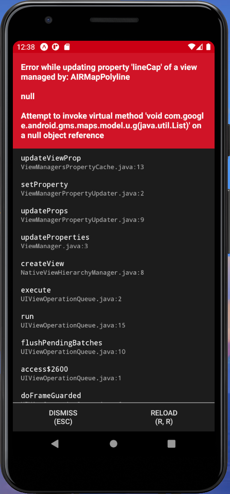

# React-native-maps-directions-issue

## Requirements

- Windows 10
- Expo v4.10.0
- Android Simulator Pixel_3a_API_30_x86 template
- react-native-maps v0.28.0
- react-native-maps-directions v1.8.0
- react-native-safe-area-context v3.2.0

## Installation

```
$ expo init react-native-maps-directions-issue
$ cd react-native-maps-directions-issue
$ yarn add react-native-safe-area-context react-native-maps-directions  react-native-maps
$ expo install react-native-safe-area-context
```

## Code

[App.js](./App.js)

[TestScreen.js](./TestScreen.js)

## Issue


